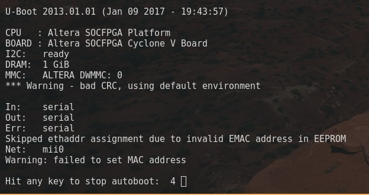
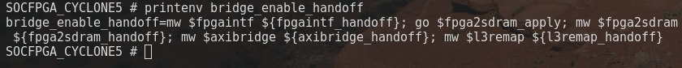
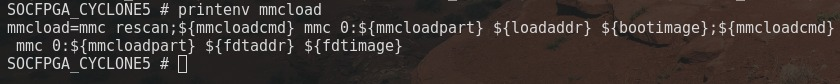
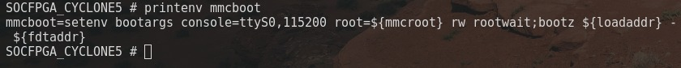
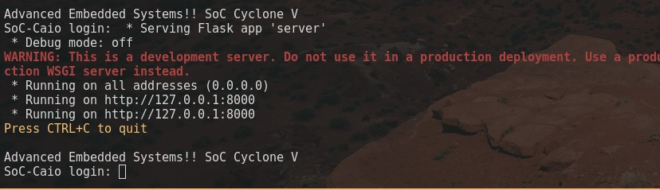

# Uboot
- **Students:** Joras Oliveira, Eduardo Barros
- **Course:** Engenharia da Computação, Ciencia da Computação
- **Semester:** 9, 6
- **Contact:** jorascco@al.insper.edu.br, eduardosmb@al.insper.edu.br
- **Year:** 2024

## Starting

To follow this tutorial you need:

- **Hardware:** DE10-Standard
- **Memory Card:** At least 8GB
- **Terminal emulator:** Any one that can read serial ports (we recommend picocom)

## Motivation


### Understanding U-Boot: Why It Matters 

U-Boot (Das U-Boot) is an essential component in the embedded Linux ecosystem, serving as a bootloader that bridges the gap between hardware initialization and operating system startup. It is one of the first pieces of software to execute on a system, handling low-level hardware configuration, loading the Linux kernel, and managing boot processes. For developers and engineers, understanding U-Boot is important because it enables control over how embedded systems boot, troubleshoot issues, and adapt to hardware-specific requirements.  

Learning the U-Boot allows developers to customize the boot process for unique hardware setups, enable advanced features like secure boot, and optimize system performance. It also provides invaluable tools for debugging, testing, and recovering embedded devices in production environments.

### History of U-Boot

The history of U-Boot begins in the late 1990s with a bootloader called 8xxROM, originally written by Magnus Damm for the PowerPC 8xx architecture. In October 1999, Wolfgang Denk took over the project and moved it to SourceForge.net, renaming it to PPCBoot, as the site did not allow project names starting with numbers. The first publicly released version, 0.4.1, came out on July 19, 2000. PPCBoot was initially focused on PowerPC-based systems, but its architecture support would soon expand.

In 2002, a brief fork of PPCBoot gave rise to ARMBoot, which was quickly merged back into the main project. On October 31, 2002, PPCBoot-2.0.0 was released, marking the last version under the PPCBoot name. The project was renamed to U-Boot (Universal Bootloader) to reflect its growing support for multiple architectures beyond PowerPC, including x86. This change was solidified with the release of U-Boot-0.1.0 in November 2002, which introduced support for the x86 architecture. Over the next couple of years, support for additional architectures was added, including MIPS, Nios II, ColdFire, and MicroBlaze, making U-Boot a versatile tool for various embedded systems.

By 2004, U-Boot had become the bootloader of choice for embedded systems, with the release of U-Boot-1.1.2 supporting over 200 board manufacturers across multiple architectures. The name "Das U-Boot" was adopted, playing on the German film *Das Boot* (The Submarine), adding a bilingual pun. U-Boot is free software, released under the GNU General Public License, and can be built on an x86 PC for various target architectures. It is widely regarded as one of the most flexible, actively developed, and feature-rich open-source bootloaders for embedded Linux systems. As highlighted in *Building Embedded Linux Systems* by Karim Yaghmour, U-Boot is seen as the "richest, most flexible, and most actively developed open-source bootloader available."


??? info 
      if you want to read more on uboot:
      https://en.wikipedia.org/wiki/Das_U-Boot,
      https://source.denx.de/u-boot/u-boot

----------------------------------------------

## Preparing the Embedded Linux

For this tutorial, we will use a pre-compiled embedded Linux (we reccomend the one from the [HPS + FPGA Blink Led](https://insper.github.io/Embarcados-Avancados/Tutorial-HPS-FPGA-BlinkLED/)). Please follow the steps below:

1. **Insert the Memory Card**
      - Insert your memory card into your computer.

2. **Create Two Partitions**
      - Create two separate partitions on your memory card.

3. **Download the ZIP Files**
      - Download the ZIP files located inside the "build" folder.

4. **Extract ZIP Contents**
      - Extract the contents of `xyx.zip` to the **first partition**.

5. **Eject the Memory Card**
      - Safely eject your memory card from the computer.

Now your memory card is prepared with the embedded Linux system.

## u-boot.src
Inside the smaller partition of SD-card, you will find a u-boot.src file, this is our uboot script, its function is similar to a bash.rc script, as it just executes each command in order, you will notice that every command inside the u-boot.src file is in itself a script, for the most past these scripts simply write something into memory then executes it. 

Open the u-boot.src file in a text editor, and you should see something like this:

```bash
if fatload mmc 0:1 $fpgadata soc_system.rbf; then
    fpga load 0 $fpgadata $filesize;
fi;
run bridge_enable_handoff;
run mmcload;
run mmcboot;
```
??? info 
        You might see some weird characters lile ' ' in the file, this is a issue related to the encoding format of the file itself.


## Entering in the uboot environment

Turn the FPGA on with the memory card inserted. After that run the picocom:
```bash
sudo picocom /dev/ttyUSB0 -b 115200
```

After you start the fpga, there should be a warning on screen telling you to press any button to disable automatic uboot, ***press any button*** so we can force the manual uboot (what we want). In this mode, we can use the printenv command to print all the environemt variables, scripts and commands. 



### Bridge enable handoff
We will start by printing the 'bridge_enable_handoff, a scirpt designed to configure hardware bridges and handoffs (transitions between stages in the hardware setup). It configures hardware bridges that facilitate communication between different components, such as the FPGA, SDRAM, and AXI bus. 

The "handoff" refers to the seamless transition of control and configuration from the bootloader (e.g., U-Boot) to the operating system or subsequent firmware. This process ensures that all necessary interfaces are properly initialized and operational, avoiding potential communication or hardware access issues as the system progresses through its boot stages. By setting up these bridges during boot, the system guarantees stable and efficient interactions between its components, paving the way for reliable operation.

The output should be:

```bash
bridge_enable_handoff=
    mw $fpgaintf ${fpgaintf_handoff};
    go $fpga2sdram_apply;
    mw $fpga2sdram ${fpga2sdram_handoff};
    mw $axibridge ${axibridge_handoff};
    mw $l3remap ${l3remap_handoff};
```



This sequence is configuring various hardware bridges and interfaces, such as the FPGA interface, [FPGA-to-SDRAM](https://www.fpga4fun.com/SDRAM.html) bridge, [AXI bridge](https://en.wikipedia.org/wiki/Advanced_eXtensible_Interface), and [L3 memory](https://en.wikipedia.org/wiki/CPU_cache) remapping. The handoff values (`${fpgaintf_handoff}`, `${fpga2sdram_handoff}`, etc.) are being written to specific hardware addresses (`$fpgaintf`, `$fpga2sdram`, `$axibridge`, `$l3remap`).

This process ensures the system is properly configured before jumping into the main system operation, such as loading the kernel or initializing other devices.

Let's go command by command, and understand this togheter.

1. **`mw $fpgaintf ${fpgaintf_handoff};`**
    - **`mw`**: This stands for "memory write," which is a U-Boot command used to write a value into a memory location.
    - **`$fpgaintf`**: This is a variable representing the address of the FPGA interface (this could be a hardware register or memory-mapped IO address).
    - **`${fpgaintf_handoff}`**: This is another variable representing the value to be written at the `$fpgaintf` address. The value contains configuration data for the FPGA interface, which will be passed from one part of the system to another as part of the "handoff" process.

    In this command, the FPGA interface is being configured by writing the value stored in `${fpgaintf_handoff}` to the address `$fpgaintf`.

---

2. **`go $fpga2sdram_apply;`**
    - **`go`**: This is a U-Boot command that is used to jump to an address in memory and start executing code from that address. It is commonly used to jump to a part of memory where code is stored (such as firmware or an application).
    - **`$fpga2sdram_apply`**: This variable holds the address of code that is responsible for applying the [FPGA-to-SDRAM](https://www.fpga4fun.com/SDRAM.html) configuration. The `go` command tells U-Boot to jump to this address and begin executing the code there.

    This command initiates the FPGA-to-SDRAM application process, possibly activating or applying the configuration that was set up earlier.

---

3. **`mw $fpga2sdram ${fpga2sdram_handoff};`**
    - **`mw`**: Writes a value to memory.
    - **`$fpga2sdram`**: This variable points to the address where the FPGA-to-SDRAM configuration should be applied.
    - **`${fpga2sdram_handoff}`**: This variable holds the configuration data to be written to the `$fpga2sdram` address. This configures how the FPGA communicates with SDRAM.

    This command writes the value stored in `${fpga2sdram_handoff}` to the address `$fpga2sdram`, configuring the bridge between the FPGA and SDRAM as part of the handoff.

---

4. **`mw $axibridge ${axibridge_handoff};`**
    - **`mw`**: Writes a value to memory.
    - **`$axibridge`**: This variable refers to the address of the [AXI bridge](https://en.wikipedia.org/wiki/Advanced_eXtensible_Interface) (a hardware component that allows communication between different parts of the system, such as between processors or memory).
    - **`${axibridge_handoff}`**: This contains the value that should be written to the `$axibridge` address. This value likely configures or enables the [AXI bridge](https://en.wikipedia.org/wiki/Advanced_eXtensible_Interface).

    This command configures the [AXI bridge](https://en.wikipedia.org/wiki/Advanced_eXtensible_Interface) by writing the value stored in `${axibridge_handoff}` to the `$axibridge` address.

??? info
    The intel site contains a lot more information on fpga AXI bridges:
    https://www.intel.com/content/www/us/en/docs/programmable/683609/21-3/axi-bridge.html

---


5. **`mw $l3remap ${l3remap_handoff};`**
    - **`mw`**: Writes a value to memory.
    - **`$l3remap`**: This variable points to the address of a component responsible for remapping memory in the system's L3 cache or memory controller.
    - **`${l3remap_handoff}`**: This variable holds the configuration value for the L3 remap process.

    This command configures the L3 remapping by writing the value stored in `${l3remap_handoff}` to the `$l3remap` address.

### MMC Load
The `mmcload` script performs two primary tasks:

1. **Prepares the MMC/SD card interface**: 
    - Ensures the card is detected and ready for file operations.

2. **Loads critical files into memory**: 
    - Loads the kernel image (or a bootloader binary) to initiate the boot process.
    - Loads the device tree blob (DTB), which describes the system's hardware configuration for the kernel.

### Step-by-Step Explanation of MMC/SD File Loading
When we print mmcload, we expect an output similar to this:

```bash
mmcload=
    mmc rescan;
    ${mmcloadcmd} mmc 0:${mmcloadpart} ${loadaddr} ${bootimage};
    ${mmcloadcmd} mmc 0:${mmcloadpart} ${fdtaddr} ${fdtimage};
```




1. **`mmc rescan;`**  
    - **`mmc`**: This is a U-Boot command for interacting with MMC (MultiMediaCard) or SD (Secure Digital) card storage devices.
    - **`rescan`**: This subcommand scans the MMC/SD card bus to detect connected devices and verify their presence. Guaranteeing that the system recognizes the card and can access its contents.  
---

2. **`${mmcloadcmd} mmc 0:${mmcloadpart} ${loadaddr} ${bootimage};`**  
    - **`${mmcloadcmd}`**: This variable defines the command to be used for loading files from the MMC/SD card. Commonly, this is set to `load` or `fatload`, which specifies the file system used (e.g., FAT).
    - **`mmc`**: Specifies the storage interface as MMC/SD card.
    - **`0:${mmcloadpart}`**: 
        - `0`: Refers to the first MMC/SD device (e.g., the first card in the system).  
        - `${mmcloadpart}`: Specifies the partition number on the card where the file is located. For example, `${mmcloadpart}` might be `1` for the first partition.
    - **`${loadaddr}`**: This variable indicates the memory address in the system’s RAM where the file will be loaded.
    - **`${bootimage}`**: This variable specifies the file name of the kernel image (or bootloader image) to be loaded from the MMC/SD card.  
   
   **Purpose**: This command reads the specified kernel image from the given partition of the MMC/SD card and places it in the system's memory at the specified address.

---

3. **`${mmcloadcmd} mmc 0:${mmcloadpart} ${fdtaddr} ${fdtimage};`**  
    - This command is nearly identical to the previous one but focuses on loading the **device tree blob (DTB)** instead of the kernel image.  
    - **`${fdtaddr}`**: Specifies the memory address where the device tree blob will be loaded.  
    - **`${fdtimage}`**: Contains the file name of the DTB, which defines the hardware configuration and is required by the kernel during boot.  

   **Purpose**: This step ensures the device tree blob is available in memory for the boot process, allowing the kernel to understand the hardware layout and initialize the system properly.


??? info
    a good read on DTB if you want: 
    https://xilinx-wiki.atlassian.net/wiki/spaces/A/pages/18842279/Build+Device+Tree+Blob

---
### MMC Boot

This U-Boot script snippet, `mmcboot`, is responsible for passing critical parameters to the Linux kernel and booting the operating system. 

This process marks the transition from the bootloader to the operating system, enabling the system to start running the Linux kernel and proceed with higher-level initialization. 

The `mmcboot` script serves two primary functions:


1. **Prepare kernel parameters**:  
    - It sets critical arguments (e.g., console configuration and root filesystem location) to guide the Linux kernel during initialization. This step ensures that the kernel has all the necessary information to start correctly and communicate with the system.

2. **Start the kernel**:  
    - It hands off control to the Linux kernel by booting the zImage kernel with the associated device tree blob.

When we print mmcboot, we expect an output similar to this:

```bash
mmcboot=
    setenv bootargs console=ttyS0,115200 root=${mmcroot} rw rootwait;
    bootz ${loadaddr} - ${fdtaddr};
```

---

1. **`setenv bootargs console=ttyS0,115200 root=${mmcroot} rw rootwait;`**  
    - **`setenv bootargs`**:  
        - This sets the `bootargs` environment variable, which contains arguments passed to the Linux kernel during boot.
    - **`console=ttyS0,115200`**:  
        - Specifies the system's console for kernel messages and input/output.  
        - `ttyS0` refers to the primary UART (serial) port.  
        - `115200` is the baud rate.
    - **`root=${mmcroot}`**:  
        - Indicates the root filesystem's location.  
        - `${mmcroot}` is an environment variable pointing to the appropriate partition on the MMC/SD card, such as `/dev/mmcblk0p1`.  
    - **`rw`**:  
        - Specifies that the root filesystem should be mounted in read-write mode, allowing the system to make changes to it during operation.
    - **`rootwait`**:  
        - Instructs the kernel to wait for the root filesystem device to be ready before proceeding, sometimes necessary to ensure a reliable mounting process.
---

2. **`bootz ${loadaddr} - ${fdtaddr};`**  
    - **`bootz`**:  
        - This command starts the Linux kernel boot process.  
        - The `z` indicates that the kernel image is in a compressed zImage format.
    - **`${loadaddr}`**:  
        - Specifies the memory address where the kernel image was previously loaded. This is the same address set by the `mmcload` script.
    - **`-`**:  
        - Placeholder for an optional initrd (initial RAM disk) image. Here, it is omitted, meaning no initrd is used.
    - **`${fdtaddr}`**:  
        - Indicates the memory address where the device tree blob (DTB) is located.
        
    **Purpose**: This command hands over control from U-Boot to the Linux kernel, using the loaded kernel image and device tree blob to initialize the operating system.

---

### Manual U-Boot
Now that we understand the U-boot process, we can manually run it by copying the commands in the correct order:

!!! info
    There should be no outputs as we run these commands. 
    Only the final mmcboot=... should print as it executes the boot.

```bash
bridge_enable_handoff=
    mw $fpgaintf ${fpgaintf_handoff};
    go $fpga2sdram_apply;
    mw $fpga2sdram ${fpga2sdram_handoff};
    mw $axibridge ${axibridge_handoff};
    mw $l3remap ${l3remap_handoff};
```

```bash
mmcload=
    mmc rescan;
    ${mmcloadcmd} mmc 0:${mmcloadpart} ${loadaddr} ${bootimage};
    ${mmcloadcmd} mmc 0:${mmcloadpart} ${fdtaddr} ${fdtimage};
```

```bash
mmcboot=
    setenv bootargs console=ttyS0,115200 root=${mmcroot} rw rootwait;
    bootz ${loadaddr} - ${fdtaddr};
```

If everything goes wright, your linux should boot by the end!



---
## Next Steps: Live debugging das U-boot 

**If you want to continue where we left off, we sugest reading up on live debbuging for the u-boot:**

- https://wiki.st.com/stm32mpu/index.php?title=U-Boot_-_How_to_debug&oldid=81073    
- https://github.com/u-boot/u-boot/blob/master/doc/develop/gdb.rst
